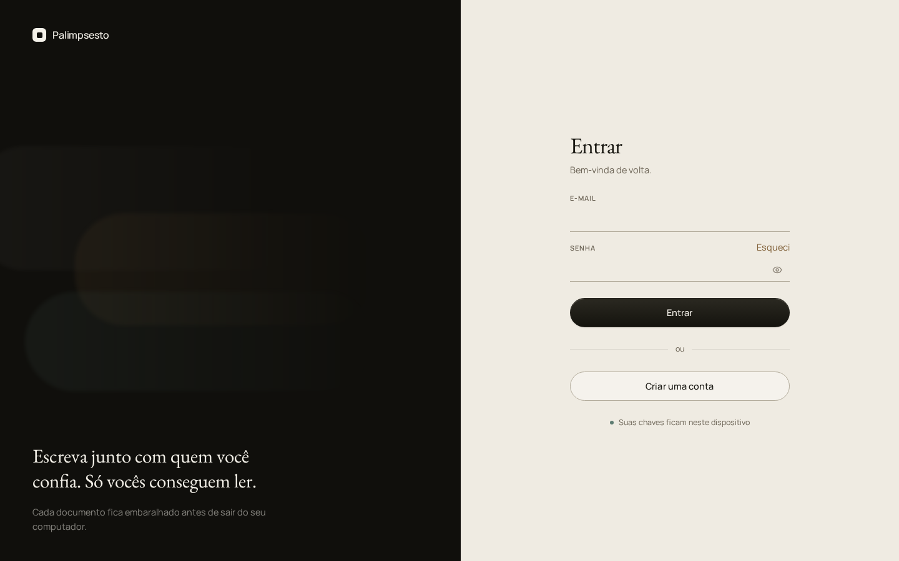
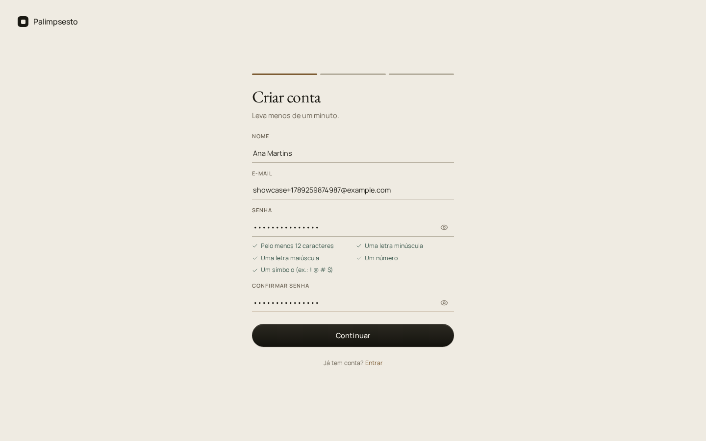
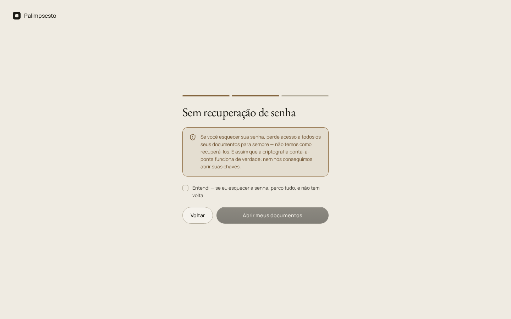
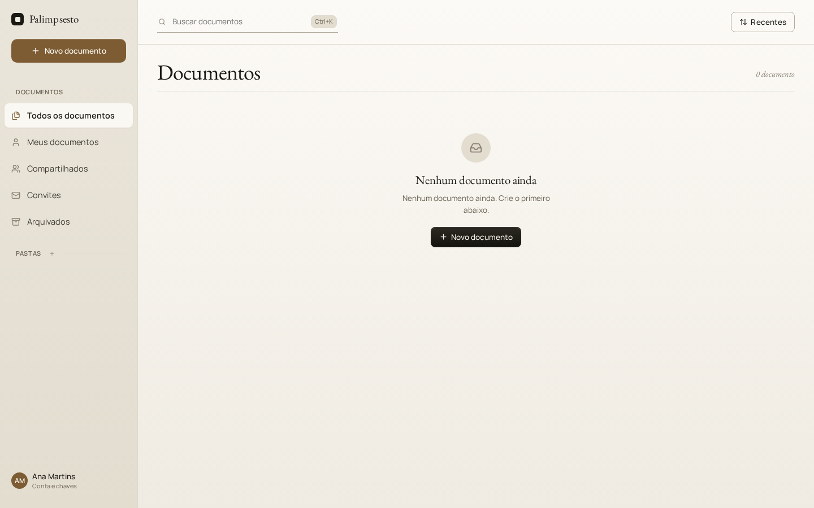
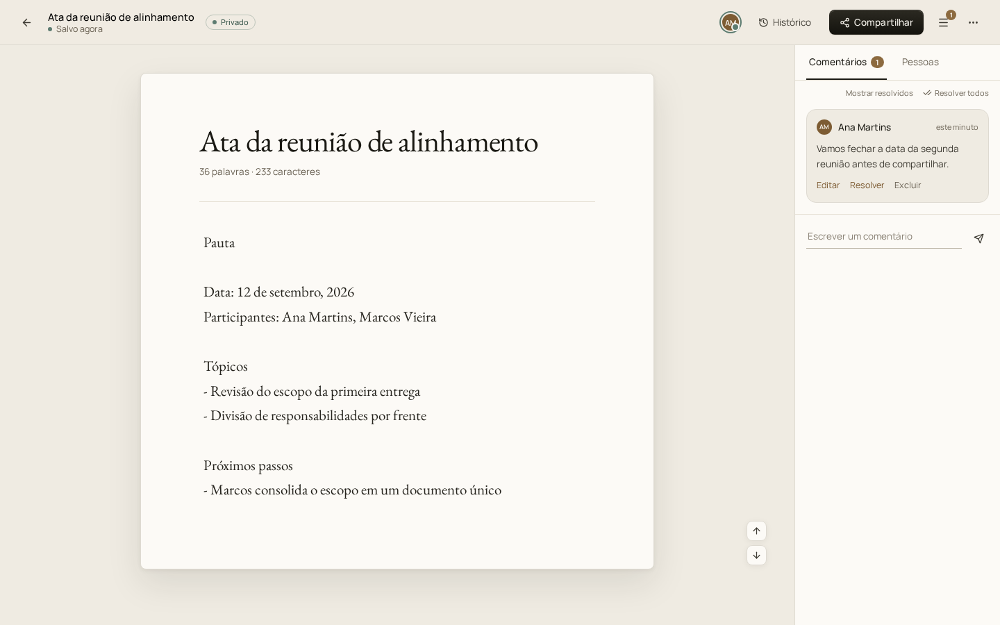
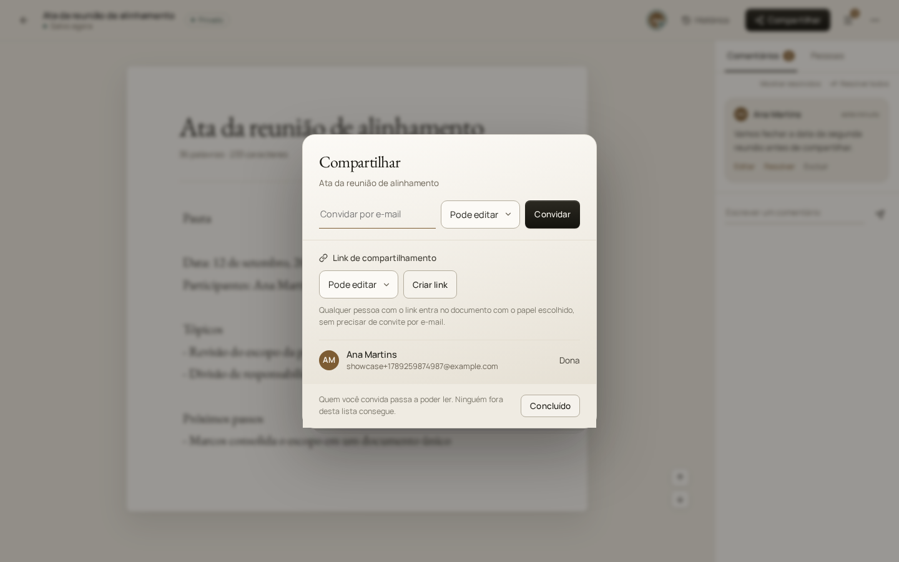
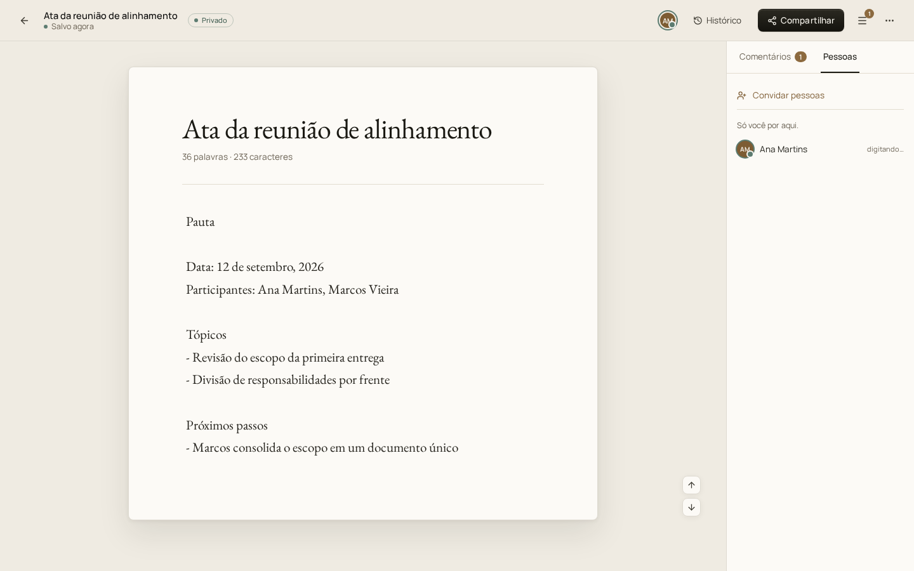
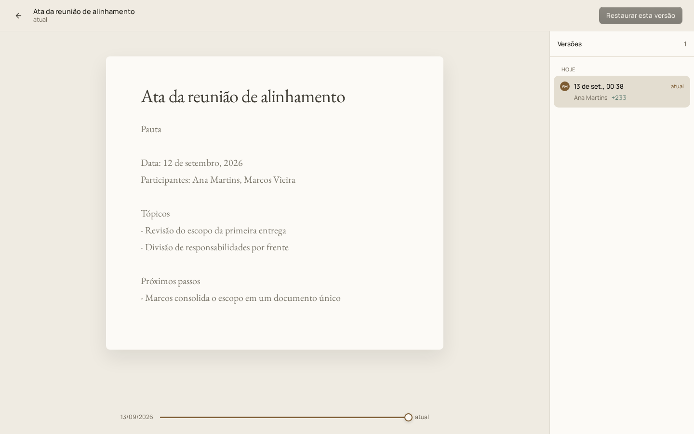
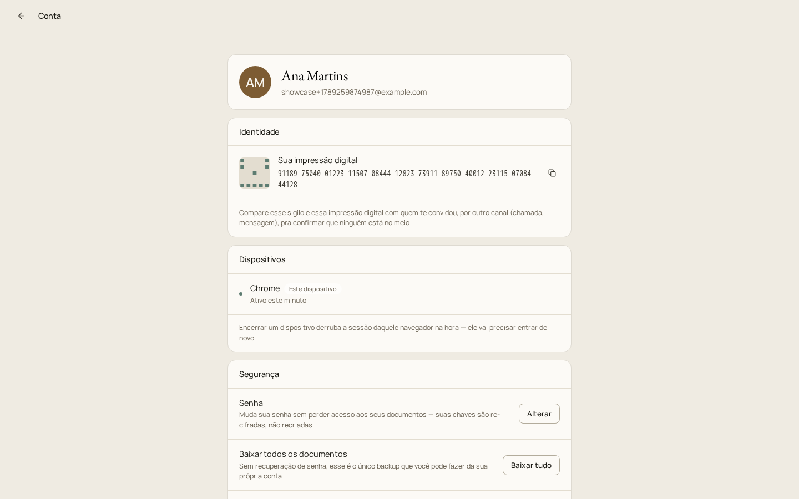

# Capturas de tela

Feitas com Playwright (`web/scripts/showcaseScreenshots.ts`, descartável — não faz parte do
repositório) contra uma conta de teste recém-criada, para mostrar o app de verdade rodando,
não mockups.

## Login

## Criar conta — dados

## Criar conta — aviso de "sem recuperação de senha"

Sem servidor de recuperação porque o servidor nunca teve a chave pra começo de conversa —
ver [`docs/CRYPTO.md`](../CRYPTO.md).

## Vault vazio

## Editor de documento

Card com borda + sombra, divisor entre o cabeçalho e o corpo, painel de comentários com
card destacado do fundo do painel, e o badge de comentário não resolvido no botão do painel
(o "1" ao lado do ícone de menu, no canto superior direito).

## Compartilhar

## Pessoas com acesso

## Histórico de versões

## Configurações da conta

Impressão digital/sigilo da identidade (pra verificação fora de banda com quem te convidou),
dispositivos ativos, e as ações de segurança (trocar senha, baixar tudo).

